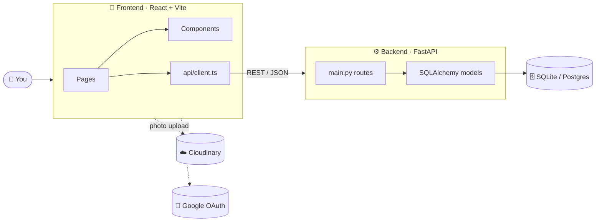
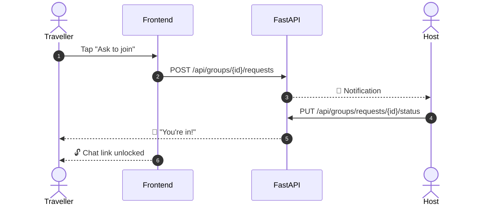
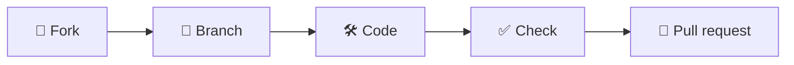

<!-- ───────────────────────── HEADER ───────────────────────── -->
<div align="center">


<a href="#-quick-start">
  
</a>

<br/>


**[Quick start](#-quick-start)** ·
**[How it works](#-how-it-fits-together)** ·
**[Contribute](#-contributing-in-5-steps)** ·
**[Good first issues](#-good-first-contributions)**

</div>

<br/>


<br/>

## ✨ What is SafarNamma?

> A travel app for people who'd rather ask a local than read a listicle.

<table>
<tr>
<td width="33%" valign="top">

### 🧭 Explore
Browse places by category, budget and state. Search forgives typos.

</td>
<td width="33%" valign="top">

### 🧑‍🤝‍🧑 Travel groups
Host a trip or ask to join one. The chat link unlocks once you're approved.

</td>
<td width="33%" valign="top">

### 📍 Submit a place
Add a hidden gem with photos. An admin reviews it before it goes live.

</td>
</tr>
<tr>
<td valign="top">

### 🌅 Weekend picks
A curated shortlist of quick getaways, chosen by admins.

</td>
<td valign="top">

### ❤️ Favourites & reviews
Save places, rate them, and read what others found.

</td>
<td valign="top">

### 🔔 Notifications
Know when a request is approved or a submission goes live.

</td>
</tr>
</table>

<br/>

## ⚡ Quick start

> **You need:** Node 18+ · Python 3.10+ · Git
> Setup takes about five minutes.

**1 — Clone**

```bash
git clone https://github.com/shahkavya23/roamlocal-.git
cd roamlocal-
```

**2 — Start the backend** &nbsp;<sub>(terminal #1)</sub>

```bash
cd backend
python -m venv venv

# Windows
.\venv\Scripts\activate
# macOS / Linux
source venv/bin/activate

pip install -r requirements.txt
uvicorn main:app --reload --port 8000
```

✅ API on **http://localhost:8000** · interactive docs on **http://localhost:8000/docs**

**3 — Start the frontend** &nbsp;<sub>(terminal #2)</sub>

```bash
cd frontend
npm install
cp .env.example .env     # then fill in the values (see below)
npm run dev
```

✅ App on **http://localhost:5173**

> [!TIP]
> The repo ships with a small SQLite database (`backend/roamlocal.db`), so you'll see places right away. No database setup needed.

<br/>

## 🔑 Environment variables

<details>
<summary><b>frontend/.env</b> &nbsp;— click to expand</summary>

<br/>

| Variable | What it's for | Required? |
|---|---|:---:|
| `VITE_CLIENT_ID` | Google OAuth client ID for sign-in | ✅ |
| `VITE_ADMIN_EMAILS` | Comma-separated emails that see the admin dashboard | ✅ |
| `VITE_CLOUD_NAME` | Cloudinary cloud name for photo uploads | for uploads |
| `VITE_CLOUDINARY_UPLOAD_PRESET` | Unsigned Cloudinary upload preset | for uploads |
| `VITE_API_BASE_URL` | Backend URL. Defaults to `http://127.0.0.1:8000/` | optional |

</details>

<details>
<summary><b>backend/.env</b> &nbsp;— click to expand</summary>

<br/>

| Variable | What it's for | Required? |
|---|---|:---:|
| `DATABASE_URL` | Any SQLAlchemy URL. Defaults to the bundled SQLite file | optional |
| `CLOUD_NAME` | Cloudinary cloud name | for uploads |
| `CLOUD_API_KEY` | Cloudinary API key | for uploads |
| `CLOUD_API_SECRET` | Cloudinary API secret | for uploads |

</details>

> [!IMPORTANT]
> Never commit a `.env` file. Both are already in `.gitignore`.

<br/>

## 🗺️ How it fits together



### What happens when someone joins a trip



<br/>

## 📂 Where things live

```text
roamlocal-/
├── 🐍 backend/
│   ├── main.py               ← every API route lives here
│   ├── SQLite/models.py      ← database tables
│   ├── Submissions/          ← Pydantic schemas + auth helpers
│   ├── server/               ← DB engine & Cloudinary setup
│   └── roamlocal.db          ← sample data to start with
│
└── ⚛️ frontend/src/
    ├── pages/                ← one file per screen (Explore, Groups, Profile…)
    ├── components/           ← reusable UI, grouped by feature
    │   └── motion/           ← scroll & reveal animations
    ├── api/client.ts         ← all calls to the backend
    ├── context/              ← auth, favourites, presence
    ├── hooks/                ← smooth scroll, tilt, reveal
    ├── utils/                ← search, categories, image helpers
    └── types/                ← shared TypeScript types
```

<details>
<summary><b>🔌 API at a glance</b> &nbsp;— click to expand</summary>

<br/>

| Area | Endpoints |
|---|---|
| 🏞️ Destinations | `GET /api/destinations` · `GET /api/destinations/{id}` · `POST` · `PUT` · `DELETE` |
| 🌅 Weekend picks | `GET /api/destinations/popular-weekend` |
| ⭐ Reviews | `GET /api/destinations/{id}/reviews` · `POST /api/reviews` |
| 🧑‍🤝‍🧑 Groups | `GET` · `POST /api/groups` · `POST /api/groups/{id}/requests` · `PUT /api/groups/requests/{id}/status` |
| 👤 Profile | `GET` · `PUT /api/users/profile` · `GET /api/users/submissions` |
| ❤️ Favourites | `GET` · `POST /api/favorites` · `DELETE /api/favorites/{id}` |
| 🛡️ Admin | `GET /api/admin/submissions` · `.../approve` · `.../reject` · `PUT /api/admin/popular-weekend` |
| 🔔 Notifications | `GET /api/notifications` · mark read · clear |

Full details, with a **Try it out** button, at **http://localhost:8000/docs**.

</details>

<br/>

## 🤝 Contributing in 5 steps



**1. Fork & clone** your copy of the repo.

**2. Create a branch** named after what you're doing:

```bash
git checkout -b feat/trip-filters     # new feature
git checkout -b fix/login-redirect    # bug fix
```

**3. Make your change.** Keep it focused: one idea per pull request.

**4. Check it works:**

```bash
cd frontend
npm run lint      # no lint errors
npm run build     # type-checks and builds
```

Then click through your change in the browser.

**5. Open a pull request** with a short description and a screenshot if the UI changed.

### ✍️ Commit style

We use short, prefixed messages:

| Prefix | Use it for | Example |
|---|---|---|
| `feat:` | something new | `feat: add budget filter to groups` |
| `fix:` | a bug fix | `fix: close modal on Escape` |
| `style:` | visual-only changes | `style: tighten card spacing on mobile` |
| `docs:` | README & comments | `docs: explain env variables` |
| `refactor:` | cleanup, same behaviour | `refactor: split GroupsPage into sections` |

<br/>

## 🌱 Good first contributions

New here? These are friendly places to start:

- [ ] 🧪 **Add tests.** There are none yet, for the frontend or the backend.
- [ ] 📄 **Add a `backend/.env.example`** that mirrors the table above.
- [ ] ♿ **Accessibility pass.** Check alt text, focus states and colour contrast.
- [ ] 🖼️ **Add real photos** of Karnataka places (credit them in `utils/images.ts`).
- [ ] 🐛 **Pick an open issue** from the [Issues tab](https://github.com/shahkavya23/roamlocal-/issues).

> [!NOTE]
> Stuck, or not sure an idea fits? Open an issue and ask. Questions are contributions too.

<br/>

## 🎨 House style

<table>
<tr><td>🧩</td><td><b>Match the code around you.</b> Same naming, same patterns, same comment density.</td></tr>
<tr><td>🎞️</td><td><b>Animations use <code>motion</code></b> and respect <code>prefers-reduced-motion</code>. See <code>components/motion/</code>.</td></tr>
<tr><td>🖼️</td><td><b>Photos are WebP</b> at 800w and 1600w in <code>public/images/</code>, registered in <code>utils/images.ts</code>.</td></tr>
<tr><td>📱</td><td><b>Test on mobile width.</b> Every page should work at 375px.</td></tr>
<tr><td>🔐</td><td><b>No secrets in code.</b> Anything private goes in <code>.env</code>.</td></tr>
</table>

<br/>

## 📸 Photo credits

Some site photos come from [Unsplash](https://unsplash.com). Each photographer is credited in the site footer and in `frontend/src/utils/images.ts`.

<br/>

<div align="center">

### 💛 Thanks for stopping by

If SafarNamma helped you or you'd like to see it grow, **leave a ⭐**. It really helps.


</div>
